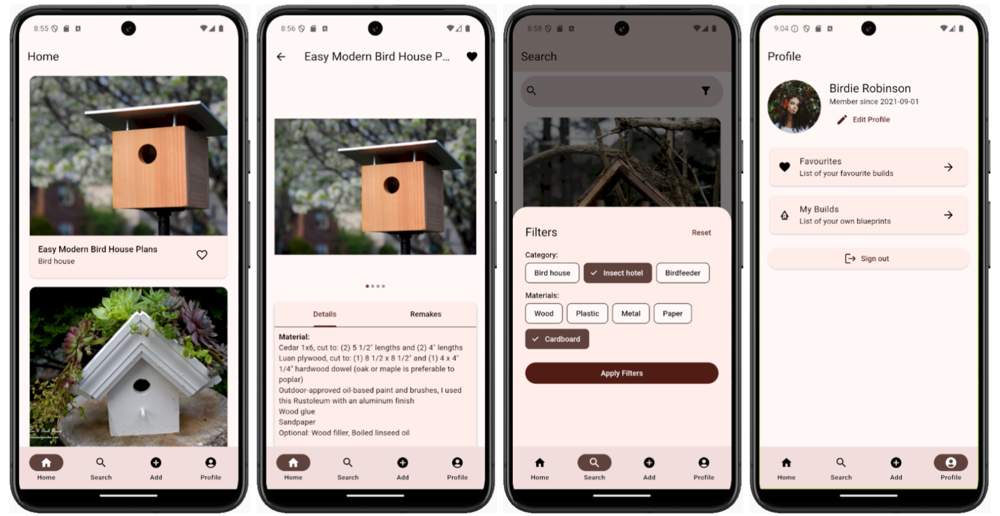

# Nestify

Project for the course "Mobile Computing: Design and Implementation - DIT075" (GU).

Nestify is an Android app to share blueprints of bird houses and insect hotels written in Flutter.

Firebase is used for authentication and for the database. The design of the app follows material design 3 guidelines.

## Functionalities
Current:

- Register, forget password. Login obviously.
- Add to favorites.
- Create/edit blueprint.
- Browse public blueprints, newest appear first
- Filter by category, material.
- Can search for a post.
- Can see my created blueprints.

Future work:

- Change home to be browseable by category instead of viewing all in one list.
- Shareable blueprints.
- Comments on blueprints.
- Edit profile.
 

Further information about the project is available [here](report.pdf).